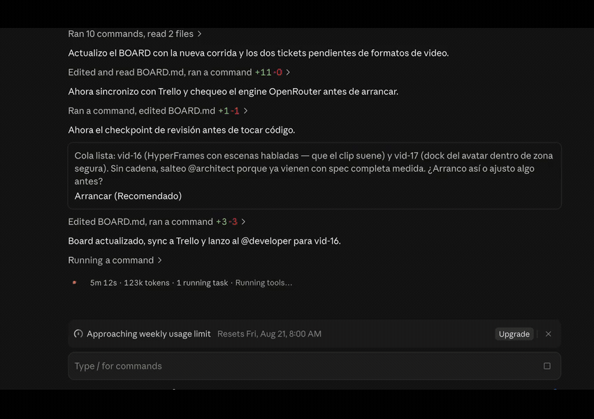
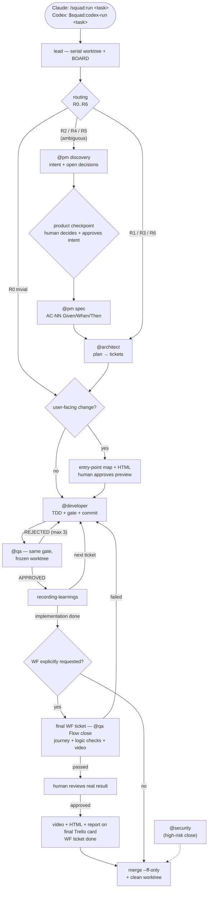

# squad — make coding agents work like an engineering team


Stop asking one coding agent to understand the product, design the change, write the code and
approve its own work.

**squad** turns Claude Code or Codex into a small engineering team: a product manager clarifies
the outcome, an architect plans the smallest change, a developer implements it, and an independent
QA agent decides whether it is ready to merge.

> **The agent that writes the code never approves it.**



*A real run (session in Spanish): the lead registers the tickets, stops at the review checkpoint
before touching code, then launches the developer — while the optional Trello mirror moves cards
live.*

It is a reusable plugin, not a project template. The workflow carries the process; each repository
carries its own stack, quality bar and verification command in one versioned contract:
`.claude/squad.md`. The path is intentionally shared by both hosts.

## Why squad?

A single agent is fast, but it has the same blind spots all the way through a task. It can
misunderstand the requirement, implement that misunderstanding, make the tests agree with it and
declare success.

squad breaks that feedback loop:

- **Independent approval.** QA reviews a frozen commit, not the developer's explanation of it.
- **One source of truth.** Developer and QA run the exact same project-defined verification gate.
- **Right-sized process.** A typo gets one agent; an auth or migration change gets planning,
  approval checkpoints, independent QA and a security pass.
- **Intent before code.** On an ambiguous task the PM agent interviews you — one decision at a
  time, with a recommendation — and you approve the intent before anything is planned.
- **Flows before screens.** User-facing changes get a clickable HTML preview and an inventory
  of every affected entry point before implementation. Ask for "prueba con WF" or `--wf` to add
  one final workflow-review ticket with logic checks, browser video and your product review.
- **Recoverable execution.** Every transition is written to `BOARD.md`, so an interrupted run can
  resume instead of starting over.
- **Isolated work.** Each run happens in its own Git worktree and reaches the base branch only
  through a verified fast-forward merge.
- **Project memory.** Rejections and non-obvious lessons become versioned knowledge for the next run.

It is designed for developers and teams already using coding agents on real repositories, where
“the code looks plausible” is not a sufficient definition of done. For a throwaway prototype, the
full loop may be unnecessary — routing deliberately keeps trivial work cheap.

### Designed from measured runs

Most of the process exists because a real run was measured and something was off:

| What the run showed | What squad does about it |
|---|---|
| Resuming a finished agent for a two-string fix cost **228k tokens**; a fresh developer, **115k** | On a rejection the lead spawns a *new* developer with the ticket, the diff and the reasons — it never resumes |
| One developer opened 12 screenshots to self-check: ~30k permanent tokens, **60% of its spend** | Evidence is generated and reported by path; QA looks at one frame per variant, once |
| The full gate ran **19 times** in a run where 8 were enough | The full gate runs once at closing; iteration uses the touched test only |
| A chain of M dependent tickets paid **2M gate runs** and M evidence captures | Deferred QA on chains: M+1 gate runs, one capture at the close |
| 4 of 5 agents paid the code-graph listing toll and went back to grep — **5 graph calls out of 497** | `squad.md` names the indexed project, so agents enter the graph directly |

## Quick start

### 1. Install the plugin

Claude Code — run inside Claude Code:

```text
/plugin marketplace add danielfarnose/claude-code-dev-loop
/plugin install squad@squad
```

Codex — run in a terminal:

```bash
codex plugin marketplace add danielfarnose/claude-code-dev-loop
codex plugin add squad@squad
```

### 2. Optional: configure Trello sync

**You do not need an `.env` file to use squad.** Both Claude Code and Codex run the core
workflow with no credentials. Create one only when you want squad to mirror `BOARD.md` to Trello.

Use the file for the host you installed:

```bash
# Codex
cp .env.example ~/.codex/squad.env

# Claude Code
cp .env.example ~/.claude/squad.env
```

Open that file and fill in only these values:

```dotenv
TRELLO_KEY=your_trello_api_key
TRELLO_TOKEN=your_trello_token
```

Get both from [Trello Power-Ups administration](https://trello.com/power-ups/admin): select your
Power-Up, open its **API Key** tab, then create a token from the **Token** link next to the key.
Do **not** put Trello's `Secret` in this file; it is for OAuth and squad does not use it.

Keep `squad.env` outside the plugin and outside your project. Plugin updates replace the installed
plugin directory, and secrets should not be committed. Environment variables set in your shell take
precedence if you need to use a different file via `SQUAD_ENV_FILE`.

Codex needs no OpenRouter key: it uses native Codex subagents. `OPENROUTER_API_KEY` and
`OPENROUTER_MODEL` in `.env.example` are optional and apply only to Claude Code.

### 3. Onboard a repository once

Ask for the `inspect-project` skill — or just launch your first task: a repository without
`.claude/squad.md` routes to `R5_NEW_PROJECT`, which runs it for you and stops at a checkpoint.
It reads the repository and drafts `.claude/squad.md`. Review that file and confirm the
verification command: this is the gate both developer and QA will trust.

### 4. Give squad a real outcome

Claude Code:

```text
/squad:run let customers download their own invoices as PDF
```

Codex:

```text
$squad:codex-run let customers download their own invoices as PDF
```

squad prints the route it chose, creates the worktree and BOARD, then moves the task through the
roles required by its risk and ambiguity. Use `resume` after an interruption and `status` for a
read-only summary.

### Recommended: build a knowledge graph of your project

Install [graphify](https://github.com/Graphify-Labs/graphify) and run `/graphify .` once at the
root of the project squad works on. It leaves a `graphify-out/` directory there; squad symlinks it
into every run's worktree, and `@architect` and `@developer` query it for orientation
(`graphify query "<question>"` — a deterministic graph traversal, no LLM call) instead of reading
whole files, which saves the tokens those reads would cost. Entirely optional: without the graph,
agents fall back to the code-graph MCP or plain grep and nothing breaks.

## What this is — and what it is not

squad is a controlled delivery loop, not a swarm of agents chatting to one another. One lead owns
the state and invokes bounded roles. Developers work one at a time; QA can review the previous
frozen commit while the next independent ticket is being implemented.

It does not replace your tests, architecture docs or engineering judgment. It makes agents obey
them. The project decides what “done” means; squad makes that decision explicit and enforces it at
every handoff.

## How a run works



---

## The roles

| Role | Responsibility | Boundary |
|------|----------------|----------|
| `@pm` | Discovers the intent first — interviews the human through the lead, one decision at a time with a recommendation — then writes acceptance criteria as `AC-NN Given/When/Then`. | No code and no technical design. |
| `@architect` | Turns the outcome and real code into the smallest executable ticket. | Writes tickets, never feature code. |
| `@developer` | Implements one ticket with TDD, runs the gate and commits it. | Cannot approve its own work. |
| `@qa` | Reviews the frozen commit; in opt-in **Flow close** mode, verifies the final workflow ticket, including coherence and business logic. Returns `APPROVED` or `REJECTED`. | Leaves no product-code changes. |
| `@security` | Audits the project's declared threat model. | Reports and files tickets; never fixes. |

Every role has a mandatory **Step 0**: read the current project's `.claude/squad.md` — stack,
quality bar, paths, verification command, forbidden zones. **Without `squad.md` the agent STOPS
and says so.** It never guesses. (`inspect-project` writes that file for a new repo.)

Two properties do most of the work:

- **Least privilege per role.** Claude restricts role tool lists directly. Codex launches QA and
  security as read-only review tasks in a frozen worktree; architect is allowed to write tickets,
  not feature code.
- **Nobody self-certifies.** The agent that writes the code is never the agent that approves it,
  and both run the *same* gate command declared in `squad.md`.

## Detailed protocol

Triggered **only** by `/squad:run <task>` in Claude Code or `$squad:codex-run <task>` in Codex. Without
that explicit invocation, the lead session is a normal chat and orchestrates nothing. The lead
orchestrates; roles never call each other.

```
0.  lead                        → run worktree (serial, cap 1) + create/update BOARD
0b. lead                        → ROUTING: decide WHICH agents run (R0..R6) and print it
    @pm (routes R2/R4/R5)       → discovery: intent + open decisions (why it matters + recommendation)
    lead ↔ human                → PRODUCT CHECKPOINT: decide, then approve the intent ("yes, that's it")
    @pm                         → specification: AC-NN Given/When/Then
1.  @architect (task or spec)  → 1..N ordered tickets (big task = split with deps), citing the AC-NN;
                                  ambiguity = assume + record "Assumption:" in the ticket
                                  (it never stops to ask — the human reviews assumptions)
1b. lead ↔ human (user flows)   → entry-point map + clickable HTML approval before implementation
2.  @developer (ticket path)    → implements + runs the squad.md gate + commits ONLY its ticket
3.  @qa (developer's commit)    → reviews that commit + runs the SAME gate
                                  → APPROVED / REJECTED: [reasons]
4.  REJECTED → back to a NEW developer with the reasons. Max 3 iterations per ticket.
5.  APPROVED → recording-learnings skill → next ticket in the queue
6.  Implementation done       → only with WF requested: final WF ticket → @qa Flow close
                                  → video + logic findings + human review + Trello attachments
7.  All required reviews pass → merge --ff-only into the base branch + delete the worktree
```

### Optional final workflow ticket — Claude Code and Codex

For user-facing changes, every route follows [flow review](docs/flow-review.md), even if the
project already has `DESIGN.md`. The architect maps all ways into the affected action and shows
a clickable HTML before the developer builds it. The map states which accesses stay, change,
disappear or redirect. It also checks the proposed journey for contradictions and logic errors.

**The final WF test is off by default.** Ask for **"prueba con WF"**, **"test with WF"**, or
`--wf` to add it. WF means the complete user workflow; its wireframe is the HTML prototype.
The same request works in both hosts:

```text
# Claude Code
/squad:run create quotes from the client page --wf

# Codex
$squad:codex-run create quotes from the client page --wf

# Natural-language equivalent, in either host
...create quotes from the client page; prueba con WF
```

The architect appends **one final ticket**, after all implementation and test-setup tickets.
It explains the starting state, steps, expected result and checks in plain language. `@qa` runs
it in **Flow close** mode once the other tickets are done. It is not another developer ticket
and is not repeated for each task. Repairs go before it; retries and resume reuse the same ticket.

For example, three implementation tickets (client validation, quote form, old-access removal)
are followed by this final card:

> **[WF] Create a quote from a client end to end**
>
> **Journey:** Open a client → create a quote → add items → save → reopen the saved quote.
>
> **Checks:** The quote belongs to that client; totals and status survive reload; dashboard,
> menu, mobile and old URLs cannot bypass the agreed flow; essential existing journeys still work.
>
> **Attachments:** Actual workflow video, approved HTML prototype and zipped test report.
>
> **Done:** QA passes, attachments are delivered and the human accepts the result.

QA also looks for **inconsistencies and business-logic errors beyond green tests**: conflicting
buttons or copy, forgotten entry points, missing prerequisites, dead ends, duplicate actions,
incorrect states or outcomes that contradict the product rules. Findings include reproduction
steps, expected versus actual behavior and evidence. A wrong product rule returns to the
architect/human; tests are not weakened to hide it.

The lead puts the journey summary and QA findings in the final ticket's BOARD Notes, which
`trello-sync.mjs` mirrors to its card. `trello-attach.mjs` attaches the **video + approved HTML +
report to that final card**, using the existing board and credentials. Implementation cards may
link to it. Retain local evidence outside disposable worktrees and retry uploads without rerunning
passing tests. Unique flow/run/commit/case/attempt filenames prevent stale attachment reuse.

Without an explicit WF request, the normal TDD/per-ticket QA loop runs with no extra final WF
ticket, recording or human result-review gate. The HTML planning checkpoint still applies to
user-facing changes. `--video` remains per-ticket evidence; it does not enable WF testing.

### Local WF tests, automatic Supabase sessions and video

When WF is requested, use the app's existing browser tests (default: local Playwright) for the
essential and requested/affected journeys. Record successful flows too and show the real result
for human acceptance. Missing required tests or video leaves the final ticket incomplete.

For Google-login apps backed by Supabase, default to the official local Supabase stack and
synthetic users prepared automatically by the test setup. Create a normal Supabase session
without asking the human for an email/password each run; keep real RLS and role checks. Test
Google OAuth itself separately when a real authorized account is available. Record that
coverage separately so a post-login journey never claims to have verified Google login.

When the app runs against a **hosted** Supabase project (evals against production edge functions,
staging, a shared preview), use the bundled QA login instead: `scripts/supabase/sbauth` keeps one
email+password QA user per project next to the humans' Google login and prints a fresh JWT with
`sbauth <project> token`; tests read it from `QA_ACCESS_TOKEN`. Agents never ask the human for a
session. See [`scripts/supabase/README.md`](scripts/supabase/README.md).

A hosted run needs a browser as well as a session: `npm i -g playwright && npx playwright install
chromium`, plus `PLAYWRIGHT_MODULE=scripts/qa/pw-shim.mjs` so ESM can resolve it from any project —
a global install alone is invisible to `import()`. `sbauth <project> doctor` verifies it by opening
a browser. And it runs against production limits — read the
remaining quota from the response, never retry a `rate_limited`/`quota_exhausted`, and give the QA
identity its own quota tier instead of raising the one every real user shares. Same reference.

The target app declares its real startup, auth/seed, test and artifact paths in `squad.md §Flows`.
At its first requested WF test, missing setup becomes a preceding implementation ticket, once.
Prefer native app/Playwright execution; only local Supabase needs its container
runtime. No paid test/video service or AI calls per normal browser test. Agent work still uses
the host's usual model allowance. Squad supplies the procedure, not a universal auth adapter or
a bundled browser runner; session wiring follows each app's installed Supabase SDK and SSR/SPA setup.

### Routing — not every task needs the full squad

The lead extracts signals from the task, **prints them**, and applies the table in strict order —
first match wins:

| Route | When | Agents |
|-------|------|--------|
| `R0_TRIVIAL` | typo, copy, doc, small style change | **1** — developer (the lead runs the gate) |
| `R1_STANDARD` | clear requirement over an existing pattern | **3** — architect → developer → qa |
| `R2_PRODUCT_CLARIFICATION` | unclear WHAT should happen | **4** — pm first + product checkpoint |
| `R3_ARCHITECTURE` | new module, data model, contract, integration, dependency | **3** |
| `R4_PM_ARCHITECT` | ambiguous **and** structural | **4** + product checkpoint |
| `R5_NEW_PROJECT` | repo without `squad.md` | **4** + `inspect-project` + 3 checkpoints |
| `R6_HIGH_RISK` | payments, auth, isolation, migration, deletion, secrets | **3-4** + checkpoint + elevated QA + security |

Ties break toward the **more expensive** route. `--route R1` or `--full` force it. The chosen route
is stored in the BOARD, so `resume` never re-routes. HTML planning for user-facing changes and
the explicit WF opt-in apply across routes. Even R0 uses independent QA for a requested final
WF ticket. A pure documentation typo still stays cheap.

### BOARD — visual board and recoverable state in one file

`<tickets-path>/BOARD.md`, **inside the run's worktree**, so board and code merge atomically.
Written **only** by the lead, on every transition. States: `ready → in_progress → qa → done |
blocked`. This is what makes `/squad:run resume` or `$squad:codex-run resume` possible after a
crash, quota exhaustion or closed laptop: the run continues exactly where it stopped. If the BOARD
and `git log` disagree,
**git wins** and the BOARD is reconciled first.

`/squad:run status` and `$squad:codex-run status` show the same thing without touching anything.

### Ticket format — a PM has to understand it without opening the code

`@architect` copies `templates/ticket.md` verbatim: `Problem` and `Expected result` read
without any knowledge of the codebase; file paths, commands, assumptions and the loop markers
(`QA:`, `Chain:`, `Risk:`) go last, under `Technical notes`. Hard rules: readable in **under 60
seconds**, **3 to 5** yes/no acceptance criteria, title `[Area] Expected result` that makes sense
unopened. Tickets are read weeks later by a human, and by a model that was never in the
conversation — a fixed format is what makes both read them the same way.

The rule that fixed the most: a title has to name the **change**, not the topic. `[Backups] Warn
before restoring a modified backup` survives being read cold; `Improve backups` or `The network
doesn't resist the actor it protects` does not — the second one sounds like it means something,
which is worse than sounding empty. What a produced ticket looks like:

```markdown
# [Backups] Stop a tampered backup from being restored silently

## Problem
Anyone with terminal access can replace the backup file with `cp`. We don't detect
the change today, so a restore can bring back someone else's data.

## Expected result
Before restoring, the system verifies the backup's integrity and, if it doesn't
match, warns and refuses to restore on its own.

## Acceptance criteria
- [ ] Integrity is verified before any restore.
- [ ] A tampered backup shows a warning that says what happened.
- [ ] A tampered backup is never restored automatically.
- [ ] A regression test fails if the verification is removed.

## Technical notes
- Files: `src/backup/restore.ts`, `src/backup/integrity.ts`
- Verification: `npm run verify`
- QA: screenshots
- Risk: high
```

`Risk: high` is not decoration: the lead reads it and raises `@qa` to a stronger model, then runs
`@security` once before the run closes.

### Discovery before requirements — the PM interviews, the human decides

On the ambiguous routes the `@pm` does not turn the idea into requirements in one step. First it
runs **discovery**: it reads the repository (it never asks what the code can answer), sorts what
it knows into `Facts` (verified), `Decisions` (agreed by the human), `Assumptions` and
`Open decisions`, and returns the open ones — each with *why it matters* and a *recommendation*.
The lead asks the human one decision at a time, recommendation first, then shows the `Intent`
block (what, why, who, what changes, what we are not doing, what success and failure look like,
one real example) and waits for "yes, that's what I want". Only then does the `@pm` write the
acceptance criteria as `AC-NN Given / When / Then`; the `@architect` cites those IDs in the
tickets, and the `@qa` reports its verdict by them: `AC-03 FAIL: expected … actual …`. The
`@developer` never invents product behavior — a choice the ticket did not cover is written down
as `Assumption:` and surfaced with the verdict, never buried in the code.

What one of those decisions looks like when it reaches you:

```text
Decision 1/3 — What should happen when publication fails?
Why it matters: without this decision, a failed post can disappear silently.
  ● Mark it FAILED, notify the user, allow a manual retry   (recommended)
  ○ Keep retrying in the background, indefinitely
  ○ Drop it and write a log line
```

You pick; the answer lands in the spec as a `Decision`, and the architect never re-opens it.

Intent, specification and plan are kept apart in *time*, not in files: one spec, one human gate
before any criterion exists, one more before any code does. Routes `R0`, `R1` and `R3` skip all
of it — a clear requirement over an existing pattern does not pay for an interview.

**See a whole run:** [`examples/BOARD.md`](examples/BOARD.md) is the board a three-ticket run
leaves behind — route, queue, iteration counts and verdicts — and
[`examples/02-download-endpoint.md`](examples/02-download-endpoint.md) is the ticket from the row
that got rejected, with the reason. That rejection is the whole argument for the design: the
`@developer` had the gate green, and the independent `@qa` — same gate — still found that the
download endpoint never checked whether the invoice belonged to the caller.

### Cost control — the parts that actually moved the needle

Most of the design here exists because something was measured, not because it sounded good:

- **Deferred QA on chains.** Tickets grouped by area (3-5, same screen/module) or with a REAL
  dependency carry `Chain: <name> · N/M · gate: deferred|closing|full`. Intermediate tickets get a cheap diff review with no gate and no
  evidence (the developer already ran the gate green); the closing ticket runs the full gate once
  over `base..HEAD`. Takes 2M gate runs down to M+1, and M evidence captures down to 1.
- **dev‖qa pipeline as the default.** `@qa` doesn't need the run's worktree, it needs *the commit*.
  `worktree.sh review` freezes a detached worktree at that commit, so QA reviews ticket N while the
  developer already works on N+1. The frozen tree can't be disturbed mid-review, and it doesn't
  consume the serial cap. Only three things force serial execution: a real `Chain:` dependency,
  route `R0_TRIVIAL`, or an empty queue.
- **Never resume a finished agent.** On a rejection the lead spawns a *new* `@developer` instead of
  resuming the previous one. Resuming reloads the entire transcript: a two-string fix cost 228k
  tokens (more than a full developer at 115k), and an amendment to code the agent had just written
  — the case where context should help most — cost **333k, more than its original commit at 250k**.
- **Independent tickets first.** A chain forces serialization, so every chained ticket is a lost
  pipeline opportunity. Putting chains last lets all independent tickets pipeline ahead of them.
- **The code graph before blind grep.** Agents query a code-graph MCP (`trace_path` for callers and
  impact, `get_code_snippet` for a single function) instead of reading whole files. With one
  caveat recorded in the prompts: on a value-function (arrow assigned to a const, a callback)
  `callers: []` is often *false*, because the indexer doesn't resolve those edges — confirm with
  grep before declaring code dead.
- **A knowledge graph for everything the code graph can't see (optional).** If the repo has a
  [graphify](https://github.com/Graphify-Labs/graphify) graph (`graphify-out/`, built once with
  `/graphify .` — AST-based, no API key for code), agents answer orientation questions with
  `graphify query "<question>" --budget 1500` instead of opening files: a deterministic traversal
  of a pre-built graph, no LLM call, output capped by the budget — and it covers docs and configs,
  not just code. `worktree.sh` symlinks `graphify-out/` into each run's worktree the same way it
  does `node_modules`. No graph or no CLI installed → agents fall back to the code graph or plain
  grep; nothing breaks and nothing new ships with the plugin.
- **Accumulated rejection reasons.** From iteration 2 on, `@qa` receives every previous reason and
  tags each `(nuevo)`/`(reincidente)`. A repeat offender means fix-A-breaks-B oscillation. The
  BOARD's `Iter` column is a free rejection metric.

### Model engine

In **Claude Code**, `@developer` and `@qa` run on `openai/gpt-5.6-sol` through
`scripts/agent-or.sh`, a separate `claude -p` process. The lead checks the engine once per run; a
missing key, inference failure or no credit selects the Claude Agent fallback without spending an
iteration.

In **Codex**, all roles use native Codex subagents and inherit the current Codex model unless the
user explicitly chose another one. Codex never calls `agent-or.sh`; the BOARD records
`codex/native` as its engine.

In either host, `REJECTED` is a product verdict, not an engine failure, and consumes an iteration.
OpenRouter is optional and only affects the Claude optimization.

## Serial worktrees — one run at a time

Each run lives in its own worktree (`~/.squad-worktrees/<project>/<run-id>`, branch
`squad/<run-id>`), managed by `scripts/worktree.sh`, **capped at 1**. The next run starts from a
base branch that is already merged: no parallel runs, no conflicts, nothing lost.

```bash
bash "${CLAUDE_PLUGIN_ROOT}/scripts/worktree.sh" list ~/my-project
```

- `new` branches from the **current** branch (it never assumes `main`) and symlinks `node_modules`
  and `.env*` from the main repo. A fresh worktree only has tracked files, so without that the
  gate explodes on the first `npx tsc`; symlinks cost 0 bytes.
- The main repo may be dirty — the worktree is built from what's committed.
- `merge` is **`--ff-only`**. If the base moved: rebase → **re-run the gate** → merge. Code the
  gate never verified does not enter the base branch.
- A `blocked` ticket **does not merge**: the worktree stays alive for inspection and the cap keeps
  another run from starting until it's resolved. That is deliberate.
- Self-check: `bash scripts/worktree-selftest.sh` — 32 assertions against a throwaway repo,
  touching nothing real.

## Host notes and configuration

The process and project contract are identical in both hosts. Claude Code discovers the role files
directly. Codex uses native skills that adapt those same role prompts to Codex subagents. The Codex
skill names include `codex-` deliberately so they cannot shadow Claude's `/squad:*` commands.

To update Claude Code, run `/plugin marketplace update squad`. To update Codex:

```bash
codex plugin marketplace upgrade squad
codex plugin remove squad@squad
codex plugin add squad@squad
```

### Optional credentials

Core development runs without them: Trello sync is skipped and Claude's developer/QA roles use their
native fallback. Copy `.env.example` to `~/.claude/squad.env` for Claude Code or
`~/.codex/squad.env` for Codex. You can instead point both hosts at one file with
`SQUAD_ENV_FILE`. The file lives **outside** the plugin cache on purpose (the cache is replaced on
every update) and outside your project's `.env` (the scripts don't read that); shell variables win
over the file.

```bash
# ~/.claude/squad.env
TRELLO_KEY=...          # Trello board mirror (optional)
TRELLO_TOKEN=...
OPENROUTER_API_KEY=...  # Claude-only developer/QA engine (optional)
# OPENROUTER_MODEL=...  # defaults to openai/gpt-5.6-sol
```

- **Trello** — from <https://trello.com/power-ups/admin>: create a power-up, open its *API key*
  tab. `TRELLO_KEY` is the API Key; `TRELLO_TOKEN` comes from the *Token* link next to it (you
  authorize by hand and it returns a long string). **The "Secret" on that page does not go
  anywhere** — it is for OAuth and these scripts never use it. Then point each project at its
  board with a `Trello: board <id>` line in that project's `squad.md`; without that line the sync
  is skipped.
- **OpenRouter** — a key from <https://openrouter.ai/settings/keys>, with credit loaded (the free
  tier cannot afford an agent turn). Without it, or without credit, the lead detects it in one
  `--check` and Claude's native Agent fallback runs instead — no iteration lost.

Tickets, BOARD and project knowledge always live in the project repository. The plugin never moves
them into its own installation directory.

## Other commands and skills

- **Patrol:** Claude `/squad:patrol …`; Codex `$squad:codex-patrol …`. Runs the gate plus exploratory
  QA (`--sec` adds `@security`), turns findings into P1-P3 tickets (cap 10 per run), and **fixes the
  P1s by itself** through the developer→qa loop (cap 3 fixes). P2/P3 stay `ready` for `/squad`. A
  finding without concrete evidence is not a ticket.
- **Board:** Claude `/squad:board [--dry-run]`; Codex `$squad:codex-board [--dry-run]`. Optional
  one-way BOARD.md → Trello mirror (`scripts/trello-sync.mjs`,
  node, zero deps). BOARD.md stays the single source of truth; editing Trello by hand doesn't
  persist. Each card gets a project-name label with a deterministic color, so one Trello board can
  serve every project — each sync only touches its own label. Every card also carries a mandatory
  **type label** (`security` · `logic` · `bug` · `feature` · `cleanup` · `copy`) with a fixed color
  (security is red on every board), so the board is scannable by kind of work at a glance. Configured per project via a
  `Trello: board <id>` line in `squad.md`; without it there is no sync and the loop skips it.

## Going live — `/squad:launch` in three steps

You have a project that works and you want it on a real domain without forgetting the legal texts,
the headers, the sitemap or the 404. Squad turns that into one command and one checklist. Written
after the first production launch (September 2026): the first time took two weeks, most of it
finding out **what was missing and in which order**.

**Step 1 — audit the live site and get the checklist.** Deploy first (Cloudflare Pages, Vercel,
whatever), then inside Claude Code, in the project:

```text
/squad:launch https://your-domain.com
```

It copies the checklist to `docs/launch/checklist.md`, runs a ~10-second `curl` audit (https and
www redirects, security headers, robots + sitemap, real 404, title/description/canonical, Open
Graph image, JSON-LD, favicon, page weight, third-party scripts, external links), ticks what it can
prove and prints two lists: **what an agent can fix now** (say «fix them» and the normal loop does
it) and **what only you can do** (accept provider DPAs, the www → root Redirect Rule, submit the
sitemap in Search Console, set Google Auth to production, the smoke test). Run the same command
again after every deploy; it only re-ticks the automatic rows.

**Step 2 — the four legal texts.** If the project has no Legal Notice / Privacy Policy / Terms /
Community Guidelines, the command launches `@legal` by itself; to run it alone, paste:

```text
Use the legal agent: write the legal texts for this project.
```

It reads the repo (sign-in, database, hosting, AI, storage keys, report button, delete-account
path…), asks you **only what the code cannot know** — who you are, which country, free or paid,
18+ or not, what users publish and under which name, how you really moderate — and writes
`docs/legal/legal-notice.md`, `privacy-policy.md`, `terms-of-use.md`, `community-guidelines.md`,
your answers in `docs/legal/legal-answers.json` (so a stack change is a re-render, not a rewrite)
and a compliance backlog with every promise the texts make that the code does not keep yet. Your
identity data stays in your repo; the plugin's templates (`templates/legal/`) carry no product and
nobody's data. Not legal advice: a licensed lawyer before charging money.

**Step 3 — do your rows, tell squad.** Close the operator rows in the checklist and say so («sitemap
submitted, DPA accepted on 2026-10-01»): the row gets ticked with the date. When every row is ✅ or
justified, you are live. The long version of the why — the order that worked, the Cloudflare /
Supabase / Google traps, the lawyer-style review, the smoke-test script — is
`templates/launch-playbook.md` (Spanish).

Without Claude Code, the same two tools run from a clone of this repo:

```bash
git clone https://github.com/danielfarnose/claude-code-dev-loop squad && cd squad
bash scripts/launch-audit.sh https://your-domain.com
cp templates/legal/answers.example.json legal-answers.json   # edit flags + vars for your product
node scripts/legal-render.mjs templates/legal/privacy-policy.md legal-answers.json > privacy-policy.md
```

The rendered file still contains `[[WRITE: …]]` sentences: those are the ones only you can write,
with your product's own words. Nothing goes live while `grep -rn "\[\[WRITE" .` finds anything.

## Design rules (so it doesn't rot)

- **Precedence:** in Claude, a local `.claude/agents/<role>.md` overrides the plugin role. In Codex,
  project-specific instructions belong in `AGENTS.md`; the shared `.claude/squad.md` remains the
  stack, gate and product contract in both hosts.
- **Models:** Claude uses the role frontmatter and optional OpenRouter engine described above.
  Codex inherits the active model for its native subagents. Both record the actual engine in BOARD.
- **Process changes go here; project specifics go in that project's `squad.md`.** A change here
  applies to every project at once.

## Layout

```
squad/
├── .agents/plugins/
│   └── marketplace.json # Codex marketplace entry
├── .codex-plugin/
│   └── plugin.json      # native Codex plugin manifest
├── .claude-plugin/
│   ├── plugin.json      # Claude plugin manifest
│   └── marketplace.json # Claude marketplace entry
├── agents/              # Claude agents; Codex skills reuse their role bodies
│   ├── pm.md
│   ├── architect.md
│   ├── developer.md
│   ├── qa.md
│   ├── security.md     # manual auditor, outside the loop
│   └── legal.md        # @legal — renders the legal templates for THIS project, asks only what the repo cannot answer
├── commands/
│   ├── run.md           # /squad:run — the ONLY loop trigger (routing + resume | status)
│   ├── patrol.md        # /squad:patrol — bug hunt → tickets → auto-fix P1
│   ├── board.md         # /squad:board — one-way Trello mirror of the BOARD (optional)
│   └── launch.md        # /squad:launch — go-live checklist + audit; runs @legal when no legal texts
├── scripts/
│   ├── agent-or.sh            # @developer and @qa over OpenRouter (--check before the first agent)
│   ├── launch-audit.sh        # ~10 s curl audit of a live domain (headers, robots, 404, meta, OG, favicon, weight)
│   ├── legal-render.mjs       # render a legal template from legal-answers.json (--check self-test)
│   ├── trello-sync.mjs        # push BOARD.md → Trello (node, zero deps; --dry-run = check)
│   ├── trello-attach.mjs      # upload @qa evidence to the card (idempotent by name)
│   ├── worktree.sh            # serial per-run worktree (new|review|list|merge|clean, cap 1)
│   └── worktree-selftest.sh   # 32 assertions for worktree.sh on a throwaway repo
├── skills/
│   ├── codex-run/             # Codex adapter; distinct name avoids shadowing Claude /run
│   ├── codex-patrol/          # Codex adapter for autonomous patrol
│   ├── codex-board/           # Codex adapter for Trello sync
│   ├── codex-security-audit/  # Codex entry point for the manual security role
│   ├── recording-learnings/   # shared self-learning
│   └── inspect-project/       # shared onboarding
├── templates/
│   ├── squad.md         # the per-project contract template
│   ├── ticket.md        # ticket template (product first, <60s, 3-5 criteria)
│   ├── launch-checklist.md    # go-live checklist copied into the project by /squad:launch
│   ├── launch-playbook.md     # the long why: order, traps, lawyer-style review, smoke test (Spanish)
│   └── legal/                 # generic Legal Notice · Privacy · Terms · Guidelines ({{VARS}}, IF blocks, [[WRITE]])
├── docs/
│   └── flow-review.md   # HTML, entry points, local Supabase sessions and flow video
└── examples/            # what a run leaves behind: a board and one rejected ticket
```

## Shipped and optional skills

The plugin ships six skills. `codex-run`, `codex-patrol`, `codex-board` and
`codex-security-audit` are the native Codex surface; their names intentionally differ from the
Claude commands so Claude's `/squad:*` command discovery cannot be shadowed. `inspect-project` and
`recording-learnings` are shared by both hosts.

The prompts also *reach for* skills this plugin deliberately does not bundle — `ponytail`,
`test-driven-development` and `systematic-debugging` for every agent, plus `impeccable`,
`motion-design` and `gsap-*` for UI tickets. Vendoring third-party skills into a plugin means
shipping someone else's code under your license and pinning a copy that silently goes stale. So
each agent states the underlying rule inline and follows it when the skill is absent, and reports
that it did. Install them separately and the agents pick them up automatically.

### Bring your own stack skills (Next, React, Python, iOS, …)

squad is stack-agnostic: the agents learn your stack from `squad.md`, and you can hand them any
skill your stack needs in two steps:

1. **Install the skill** where your host discovers it — a marketplace plugin
   (`/plugin install …` in Claude Code), or a plain skill folder in `~/.claude/skills/<name>/`
   (global) or `<project>/.claude/skills/<name>/` (that repo only).
2. **Declare it in the project's `.claude/squad.md`, section `§Skills by task type`** — that is
   the wiring. `@developer` treats the skills flagged there as mandatory for matching tickets,
   and on a clash they win over its own defaults.

```markdown
## §Skills by task type
- Tickets touching React components or Next routes → skill `vercel-nextjs-best-practices`.
- Python code → skill `python-modern-idioms`.
- iOS / Swift tickets → skill `swift-ui-review`.
- Everything else: none extra (the agents' own ponytail + TDD apply).
```

The skill names above are examples — declare whatever you actually installed. Agents treat
`§Skills` entries as mandatory for matching tickets, so declare only skills that exist on the
machine; the built-in defaults (ponytail, TDD, the design trio) are the ones that degrade
gracefully when absent.

## Try the method on one real task

Choose a repository with a meaningful test or verification command. Onboard it, give squad a task
you would normally hand to one coding agent, then read the ticket, BOARD and independent QA verdict.
The method should earn its complexity by catching something or making the handoffs clearer.

If it helps, star the repository, share what happened, or
[open an issue](https://github.com/danielfarnose/claude-code-dev-loop/issues). Real run reports —
especially rejections and failure cases — are the most useful feedback.

## License

[MIT](LICENSE)
