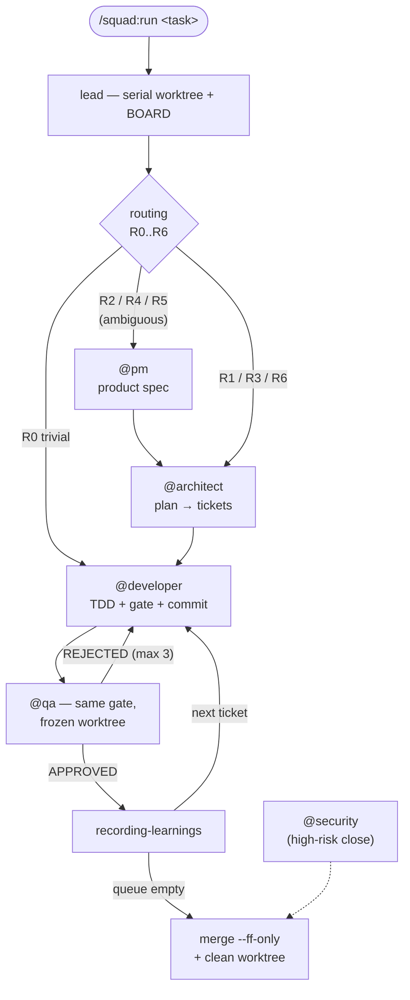

# squad — a multi-agent development loop for Claude Code


Five specialized Claude Code subagents that run a real development loop — plan, implement, verify,
merge — across every project on the machine, on one principle:

> **The global agents carry the PROCESS. Each project carries the KNOWLEDGE, in
> `.claude/squad.md` inside its own repo.**

It installs as a Claude Code plugin, and nothing in it is project-specific: point it at a new repo,
write that repo's `squad.md`, and the same loop runs against a different stack.




---

## The agents

| Agent | Role | Model |
|-------|------|-------|
| `@pm` | Prioritized backlog, product specs, roadmap. Writes no code and no technical tickets. Only runs on ambiguous routes (R2/R4/R5). | opus |
| `@architect` | Brainstorm + minimal plan → ticket. Writes no feature code. | fable |
| `@developer` | Implements one ticket with TDD and minimum code, runs the gate, commits its isolated change. | GPT-5.6 Sol via OpenRouter · sonnet fallback |
| `@qa` | Read-only gate: runs the project's verification and answers `APPROVED` / `REJECTED: [reasons]` (or `REJECTED (design):` when the defect is in the ticket itself → back to the architect). | GPT-5.6 Sol via OpenRouter · sonnet fallback (`Risk: high` or chain close → opus override) |
| `@security` | **Manual** security auditor, outside the loop: multi-tenant isolation, data/pricing leaks, prompt injection at AI entry points, data destruction. Read-only — reports and files tickets, never fixes. | fable |

Every agent has a mandatory **Step 0**: read the current project's `.claude/squad.md` — stack,
quality bar, paths, verification command, forbidden zones. **Without `squad.md` the agent STOPS
and says so.** It never guesses. (`inspect-project` writes that file for a new repo.)

Two properties do most of the work here:

- **Least privilege per role.** `@qa` and `@security` have no write tools at all, so a gate
  cannot edit the code it is judging. `@architect` can write tickets but not source.
- **Nobody self-certifies.** The agent that writes the code is never the agent that approves it,
  and both run the *same* gate command declared in `squad.md`.

## The loop

Triggered **only** by `/squad:run <task>`. Without the command, the lead session is a normal chat and
orchestrates nothing. The lead orchestrates; agents never call each other.

```
0.  lead                        → run worktree (serial, cap 1) + create/update BOARD
0b. lead                        → ROUTING: decide WHICH agents run (R0..R6) and print it
    @pm (routes R2/R4/R5)       → product spec / backlog
1.  @architect (task or spec)  → 1..N ordered tickets (big task = split with deps);
                                  ambiguity = assume + record "Assumption:" (never blocks asking)
2.  @developer (ticket path)    → implements + runs the squad.md gate + commits ONLY its ticket
3.  @qa (developer's commit)    → reviews that commit + runs the SAME gate
                                  → APPROVED / REJECTED: [reasons]
4.  REJECTED → back to a NEW developer with the reasons. Max 3 iterations per ticket.
5.  APPROVED → recording-learnings skill → next ticket in the queue
6.  Queue empty and all done → merge --ff-only into the base branch + delete the worktree
```

### Routing — not every task deserves five agents

The lead extracts signals from the task, **prints them**, and applies the table in strict order —
first match wins:

| Route | When | Agents |
|-------|------|--------|
| `R0_TRIVIAL` | typo, copy, doc, small style change | **1** — developer (the lead runs the gate) |
| `R1_STANDARD` | clear requirement over an existing pattern | **3** — architect → developer → qa |
| `R2_PRODUCT_CLARIFICATION` | unclear WHAT should happen | **4** — pm first |
| `R3_ARCHITECTURE` | new module, data model, contract, integration, dependency | **3** |
| `R4_PM_ARCHITECT` | ambiguous **and** structural | **4** |
| `R5_NEW_PROJECT` | repo without `squad.md` | **4** + `inspect-project` + 2 checkpoints |
| `R6_HIGH_RISK` | payments, auth, tenant isolation, migration, deletion, secrets | **3-4** + approval before coding + qa on opus + `@security` |

Ties break toward the **more expensive** route. `--route R1` or `--full` force it. The chosen route
is stored in the BOARD, so `resume` never re-routes.

### BOARD — visual board and recoverable state in one file

`<tickets-path>/BOARD.md`, **inside the run's worktree**, so board and code merge atomically.
Written **only** by the lead, on every transition. States: `ready → in_progress → qa → done |
blocked`. This is what makes `/squad:run resume` possible after a crash, a quota exhaustion or a
closed laptop: the run continues exactly where it stopped. If the BOARD and `git log` disagree,
**git wins** and the BOARD is reconciled first.

`/squad:run status` shows the same thing without touching anything.

### Ticket format — a PM has to understand it without opening the code

`@architect` copies `templates/ticket.md` verbatim: `Problem` and `Expected result` read
without any knowledge of the codebase; file paths, commands, assumptions and the loop markers
(`QA:`, `Chain:`, `Risk:`) go last, under `Technical notes`. Hard rules: readable in **under 60
seconds**, **3 to 5** yes/no acceptance criteria, title `[Area] Expected result` that makes sense
unopened. Tickets are read weeks later by a human, and by a model that was never in the
conversation — a fixed format is what makes both read them the same way.

The rule that fixed the most: a title has to name the **change**, not the topic. `[Backups] Warn
before restoring a modified backup` survives being read cold; `Improve backups` or `The network
doesn't resist the actor it protects` does not — the second one sounds like it means something,
which is worse than sounding empty. What a produced ticket looks like:

```markdown
# [Backups] Stop a tampered backup from being restored silently

## Problem
Anyone with terminal access can replace the backup file with `cp`. We don't detect
the change today, so a restore can bring back someone else's data.

## Expected result
Before restoring, the system verifies the backup's integrity and, if it doesn't
match, warns and refuses to restore on its own.

## Acceptance criteria
- [ ] Integrity is verified before any restore.
- [ ] A tampered backup shows a warning that says what happened.
- [ ] A tampered backup is never restored automatically.
- [ ] A regression test fails if the verification is removed.

## Technical notes
- Files: `src/backup/restore.ts`, `src/backup/integrity.ts`
- Verification: `npm run verify`
- QA: screenshots
- Risk: high
```

`Risk: high` is not decoration: the lead reads it and raises `@qa` to a stronger model, then runs
`@security` once before the run closes.

**See a whole run:** [`examples/BOARD.md`](examples/BOARD.md) is the board a three-ticket run
leaves behind — route, queue, iteration counts and verdicts — and
[`examples/02-download-endpoint.md`](examples/02-download-endpoint.md) is the ticket from the row
that got rejected, with the reason. That rejection is the whole argument for the design: the
`@developer` had the gate green, and the `@qa` — same gate, no write tools — still found that the
download endpoint never checked whether the invoice belonged to the caller.

### Cost control — the parts that actually moved the needle

Most of the design here exists because something was measured, not because it sounded good:

- **Deferred QA on chains.** Tickets with a REAL dependency carry `Chain: <name> · N/M · gate:
  diferido|cierre|completo`. Intermediate tickets get a cheap diff review with no gate and no
  evidence (the developer already ran the gate green); the closing ticket runs the full gate once
  over `base..HEAD`. Takes 2M gate runs down to M+1, and M evidence captures down to 1.
- **dev‖qa pipeline as the default.** `@qa` doesn't need the run's worktree, it needs *the commit*.
  `worktree.sh review` freezes a detached worktree at that commit, so QA reviews ticket N while the
  developer already works on N+1. The frozen tree can't be disturbed mid-review, and it doesn't
  consume the serial cap. Only three things force serial execution: a real `Chain:` dependency,
  route `R0_TRIVIAL`, or an empty queue.
- **Never resume a finished agent.** On a rejection the lead spawns a *new* `@developer` instead of
  resuming the previous one. Resuming reloads the entire transcript: a two-string fix cost 228k
  tokens (more than a full developer at 115k), and an amendment to code the agent had just written
  — the case where context should help most — cost **333k, more than its original commit at 250k**.
- **Independent tickets first.** A chain forces serialization, so every chained ticket is a lost
  pipeline opportunity. Putting chains last lets all independent tickets pipeline ahead of them.
- **The code graph before blind grep.** Agents query a code-graph MCP (`trace_path` for callers and
  impact, `get_code_snippet` for a single function) instead of reading whole files. With one
  caveat recorded in the prompts: on a value-function (arrow assigned to a const, a callback)
  `callers: []` is often *false*, because the indexer doesn't resolve those edges — confirm with
  grep before declaring code dead.
- **Accumulated rejection reasons.** From iteration 2 on, `@qa` receives every previous reason and
  tags each `(nuevo)`/`(reincidente)`. A repeat offender means fix-A-breaks-B oscillation. The
  BOARD's `Iter` column is a free rejection metric.

### Model engine

`@developer` and `@qa` are the two agents that run most — one per ticket, plus one per rejection
iteration — so they run on `openai/gpt-5.6-sol` through `scripts/agent-or.sh`, a separate
`claude -p` process (backends cannot be mixed per-subagent inside a single session). The lead runs
`agent-or.sh --check` **once per run** before the first agent; on exit 78 (missing key, key can't
infer, or no credit) it doesn't even try and starts on the fallback.

Engine failure — non-zero exit, timeout, developer with no new commit, qa with no verdict — falls
back to the Claude Agent tool with the *same* prompt and **without consuming an iteration**. A
`REJECTED` from `@qa` is not an engine failure; it's the loop working. The BOARD records which
engine produced each verdict, otherwise the two can never be compared. `@architect`, `@pm` and
`@security` always run on the Agent tool.

Without an OpenRouter key the loop runs fine on the fallback.

## Serial worktrees — one run at a time

Each run lives in its own worktree (`~/.squad-worktrees/<project>/<run-id>`, branch
`squad/<run-id>`), managed by `scripts/worktree.sh`, **capped at 1**. The next run starts from a
base branch that is already merged: no parallel runs, no conflicts, nothing lost.

```bash
bash "${CLAUDE_PLUGIN_ROOT}/scripts/worktree.sh" list ~/my-project
```

- `new` branches from the **current** branch (it never assumes `main`) and symlinks `node_modules`
  and `.env*` from the main repo. A fresh worktree only has tracked files, so without that the
  gate explodes on the first `npx tsc`; symlinks cost 0 bytes.
- The main repo may be dirty — the worktree is built from what's committed.
- `merge` is **`--ff-only`**. If the base moved: rebase → **re-run the gate** → merge. Code the
  gate never verified does not enter the base branch.
- A `blocked` ticket **does not merge**: the worktree stays alive for inspection and the cap keeps
  another run from starting until it's resolved. That is deliberate.
- Self-check: `bash scripts/worktree-selftest.sh` — 32 assertions against a throwaway repo,
  touching nothing real.

## Install

This is a Claude Code **plugin**, and the repo is its own marketplace. Two commands inside Claude
Code:

```
/plugin marketplace add danielfarnose/claude-code-dev-loop
/plugin install squad@squad
```

That's it — no clone, no install script, no symlinks. The agents, `/squad:run`, `/squad:patrol`
and `/squad:board` are available in every project, and `/plugin marketplace update` pulls new
versions.

**Optional credentials.** Everything runs without them: Trello sync is skipped and
`@developer`/`@qa` fall back to the Claude Agent tool. To enable either, copy `.env.example` to
`~/.claude/squad.env` and fill in what you need. It lives in `~/.claude/` on purpose — a plugin is
installed into a cache directory that gets replaced on every update, so credentials stored inside
the plugin would not survive. Shell variables always win over the file.

## Onboarding a repo

1. Run the `inspect-project` skill against it: it reads manifests, scripts, structure and sensitive
   zones, then drafts `.claude/squad.md`. Read-only over the code. It **never invents** the
   `§Verification` command — it proposes candidates and asks, because the gate is the loop's source
   of truth.
2. Review every section and **confirm the gate**.
3. Commit it inside that project's repo, so it travels with the worktrees.

Tickets always live inside each project. This repo never touches or moves them.

## Other commands

- **`/squad:patrol [area] [--sec]`** — autonomous bug hunt: runs the gate plus an exploratory `@qa`
  (`--sec` adds `@security`), turns findings into P1-P3 tickets (cap 10 per run), and **fixes the
  P1s by itself** through the developer→qa loop (cap 3 fixes). P2/P3 stay `ready` for `/squad`. A
  finding without concrete evidence is not a ticket.
- **`/squad:board [--dry-run]`** — optional one-way BOARD.md → Trello mirror (`scripts/trello-sync.mjs`,
  node, zero deps). BOARD.md stays the single source of truth; editing Trello by hand doesn't
  persist. Each card gets a project-name label with a deterministic color, so one Trello board can
  serve every project — each sync only touches its own label. Configured per project via a
  `Trello: board <id>` line in `squad.md`; without it there is no sync and the loop skips it.

## Design rules (so it doesn't rot)

- **Precedence:** a local agent in the project's `.claude/agents/` with the same name overrides the
  global one. That is how a single project gets customized without touching this repo. Watch for
  accidental collisions — a project's exploratory QA agent named `qa` would silently replace the
  gate.
- **Models:** architect/security on `claude-fable-5`, pm on `claude-opus-5`. The `model:` in
  developer/qa frontmatter (`claude-sonnet-5`) is the **fallback**, not the usual path — see the
  engine section. If a model's quota runs out mid-loop, the lead overrides to opus *in the call*
  and notes it in the BOARD; the agent's frontmatter is never edited for that.
- **Process changes go here; project specifics go in that project's `squad.md`.** A change here
  applies to every project at once.

## Layout

```
squad/
├── .claude-plugin/
│   ├── plugin.json      # plugin manifest
│   └── marketplace.json # the repo is its own marketplace — one repo, one install
├── agents/              # auto-discovered by the plugin loader
│   ├── pm.md
│   ├── architect.md
│   ├── developer.md
│   ├── qa.md
│   └── security.md     # manual auditor, outside the loop
├── commands/
│   ├── run.md           # /squad:run — the ONLY loop trigger (routing + resume | status)
│   ├── patrol.md        # /squad:patrol — bug hunt → tickets → auto-fix P1
│   └── board.md         # /squad:board — one-way Trello mirror of the BOARD (optional)
├── scripts/
│   ├── agent-or.sh            # @developer and @qa over OpenRouter (--check before the first agent)
│   ├── trello-sync.mjs        # push BOARD.md → Trello (node, zero deps; --dry-run = check)
│   ├── trello-attach.mjs      # upload @qa evidence to the card (idempotent by name)
│   ├── worktree.sh            # serial per-run worktree (new|review|list|merge|clean, cap 1)
│   └── worktree-selftest.sh   # 32 assertions for worktree.sh on a throwaway repo
├── skills/
│   ├── recording-learnings/   # self-learning: writes per-project knowledge after each approval
│   └── inspect-project/       # onboarding: drafts/refreshes a repo's squad.md
├── templates/
│   ├── squad.md         # the per-project contract template
│   └── ticket.md        # ticket template (product first, <60s, 3-5 criteria)
└── examples/            # what a run leaves behind: a board and one rejected ticket
```

## Optional skills

The plugin ships the two skills the loop owns: `inspect-project` (onboards a repo by drafting its
`squad.md`) and `recording-learnings` (writes per-project knowledge after each approval).

The prompts also *reach for* skills this plugin deliberately does not bundle — `ponytail`,
`test-driven-development` and `systematic-debugging` for every agent, plus `impeccable`,
`motion-design` and `gsap-*` for UI tickets. Vendoring third-party skills into a plugin means
shipping someone else's code under your license and pinning a copy that silently goes stale. So
each agent states the underlying rule inline and follows it when the skill is absent, and reports
that it did. Install them separately and the agents pick them up automatically.

## License

[MIT](LICENSE)
